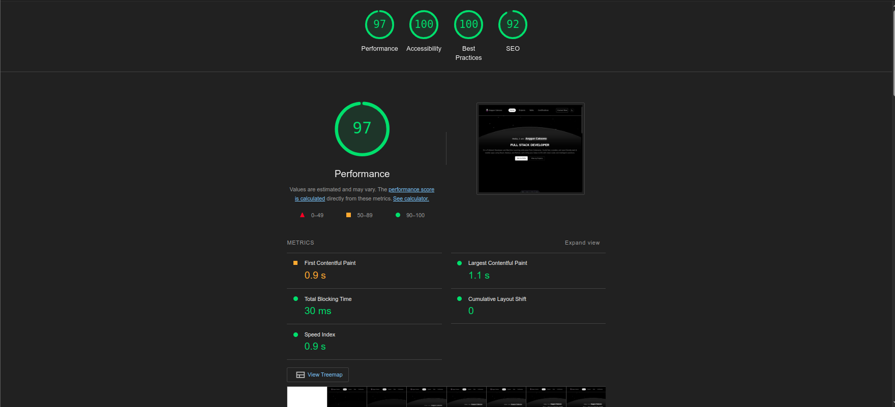

# **Personal Portfolio Project**

🎨 **A modern and fully responsive portfolio website** built with the latest technologies to showcase your skills, projects, and experiences in style.

## **About the Project**

This repository contains the source code for my **Personal Portfolio Website**, developed using **Astro JS** and **React JS**. The project is designed to be fast, responsive, and visually appealing, providing recruiters and visitors with a seamless experience while exploring my profile, projects, and contact information.

## **Features**

- **🌟 Modern Design**: A clean and professional layout to leave a great first impression.
- **⚡ Fast Performance**: Optimized for speed and responsiveness using Astro JS.
- **📱 Responsive Design**: Fully compatible with desktops, tablets, and mobile devices.
- **📂 Project Showcase**: Highlight your top projects with detailed descriptions, technologies used, and live/demo links.
- **📧 Contact Form**: Allows visitors to easily get in touch.
- **🌙 Dark/Light Mode**: A toggle for users to switch between dark and light themes.

## **Tech Stack**

- **Astro JS**: Framework for building fast, optimized web pages.
- **React JS**: For creating interactive UI components.
- **Vite**: Build tool for fast development and optimized production builds.
- **Tailwind CSS**: Utility-first CSS framework for styling.

### **Development Tools**

- JavaScript
- Astro
- TypeScript
- CSS

## **Getting Started**

Follow these instructions to set up the project locally:

### **Prerequisites**

- Node.js (v18 or later)
- npm or yarn
- Git
- A code editor (e.g., Visual Studio Code)

### **Installation**

1. Clone the repository to your local machine.

    ```bash
    git clone https://github.com/alrescha79-cmd/porto.git
    ```

2. Navigate to the project directory.

    ```bash
    cd porto
    ```

3. Install the dependencies.

    ```bash
    npm install
    ```

4. Start the development server.

    ```bash
    npm start
    ```

5. Open your browser and visit `http://localhost:4321` to view the website.

## **Lighthouse Report**



## **Project Structure**

```plaintext
porto/
├── public/                # Static assets
├── src/                   # Source code
│   ├── components/        # Reusable components
│   ├── layouts/           # Layout components
│   ├── pages/             # Page components
│   ├── styles/            # Global styles
│   ├── utils/             # Utility functions
│   └── assets/            # Images and other assets
├── .gitignore             # Git ignore file
├── astro.config.mjs       # Astro configuration
├── package.json           # Project metadata and dependencies
├── README.md              # Project documentation
└── vite.config.js         # Vite configuration
```

## **Contributing**

Contributions are welcome! If you have suggestions for improvements or new features, please open an issue or submit a pull request.

### **Steps to Contribute**

1. Fork the repository.
2. Create your feature branch:

    ```bash
    git checkout -b feature/amazing-feature
    ```

3. Commit your changes:

    ```bash
    git commit -m 'Add some amazing feature'
    ```

4. Push to the branch:

    ```bash
    git push origin feature/amazing-feature
    ```

5. Open a pull request.

## **License**

This project is licensed under the MIT License. See the [LICENSE](LICENSE) file for details.

## **Contact**

📧 **Email:** [anggun@cakson.my.id](mailto:anggun@cakson.my.id)  
🌐 **Website:** [cakson.my.id](https://cakson.my.id)  
🔗 **GitHub:** [github.com/alrescha79-cmd](https://github.com/alrescha79-cmd)  
💼 **LinkedIn:** [linkedin.com/in/angguncaksono](https://www.linkedin.com/in/angguncaksono)  

## Acknowledgments

- Thanks to the open-source community for their amazing tools and libraries.
- Special thanks to [Astro](https://astro.build/) and [React](https://reactjs.org/) for their incredible frameworks.
