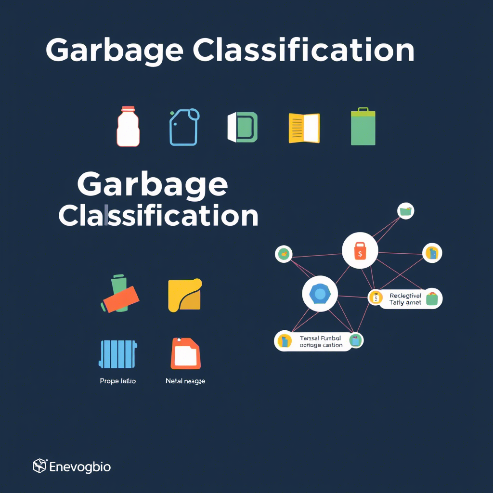

### **Project Description**

This repository contains the final project submission for the Image Classification Project as part of the [IDCamp 2024](https://idcamp.ioh.co.id/) program. The project focuses on classifying garbage images into distinct categories using machine learning techniques implemented in Jupyter Notebook.

---

#### **Programming Language**

- **Jupyter Notebook**

---

#### **Key Features**

- **Data Collection and Preprocessing**: Gathering a comprehensive dataset of garbage images and performing preprocessing steps such as resizing, normalization, and data augmentation.
- **Deep Learning Models**: Implementation of deep learning models, including Convolutional Neural Networks (CNNs), for image classification.
- **Transfer Learning**: Utilization of pre-trained models (Xception) to enhance classification accuracy and reduce training time.
- **Model Training and Optimization**: Training the models with various hyperparameters and optimization techniques to achieve the best performance.
- **Evaluation and Validation**: Evaluating model performance using metrics such as accuracy, precision, recall, and F1-score. Validating the model on a separate test dataset.
- **Visualization**: Visualizing training progress, loss curves, and model predictions to better understand model behavior and performance.

---

#### **Technologies Used**

- **Jupyter Notebook**: For interactive development, experimentation, and documentation of the machine learning workflow.
- **TensorFlow and Keras**: For building and training deep learning models.
- **Pandas and NumPy**: For data manipulation and preprocessing.
- **Matplotlib and Seaborn**: For creating informative visualizations of data and model performance.
- **Scikit-learn**: For additional machine learning tools and model evaluation metrics.

---

#### **Project Highlights**

- **Comprehensive Workflow**: The project covers the entire image classification pipeline from data collection to model evaluation, showcasing a robust understanding of deep learning techniques.
- **Reproducibility**: All steps and results are documented in Jupyter Notebooks, ensuring that the work can be easily reproduced and verified.
- **Practical Application**: Demonstrates practical application of deep learning algorithms to solve a real-world problem of garbage classification, reflecting a hands-on approach to learning.
- **Performance Optimization**: Highlighting the use of transfer learning and hyperparameter tuning to achieve high classification accuracy.

---

#### **Links**

- Repository: [GitHub - alrescha79-cmd/garbage-classification](https://github.com/alrescha79-cmd/garbage-classification)

- Dataset: [Kaggle - Garbage Classification](https://www.kaggle.com/datasets/mostafaabla/garbage-classification)

- Notebook: [Kaggle Notebook - Submission Garbage Classification](https://www.kaggle.com/code/angguncaksono/submission-garbage-classification)

---
