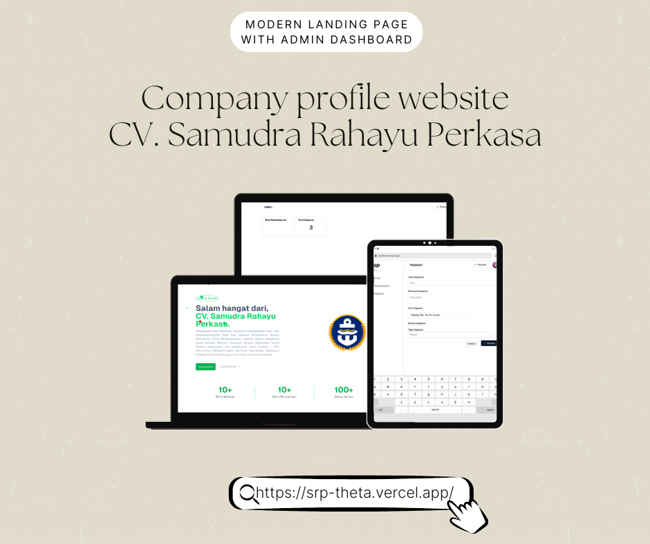

**Description:**  
This project is a comprehensive solution built using **TypeScript** as the core language, focusing on delivering a scalable, efficient, and maintainable web application. Developed with cutting-edge technologies, the **Project SRP Pati** aims to provide seamless functionality and exceptional user experience.

---

### **Key Features:**

- **TypeScript-Powered Architecture:** Ensures type safety, reducing runtime errors and making the codebase more robust and maintainable.
- **Modern Design and Styling:** Includes dynamic and responsive user interfaces, styled using **CSS**, for an optimized experience across all devices.
- **High-Performance Backend:** Implements efficient backend logic with minimal use of **JavaScript** for lightweight and fast processing.
- **Scalability in Mind:** Designed to handle growing user demands with ease, ensuring long-term sustainability.
- **Clean and Modular Codebase:** Written with clean coding practices that make the project easy to understand, modify, and extend.

---

### **Tech Stack**

- **TypeScript (96.7%)**: The backbone of the project, providing type-safe development and enhancing developer productivity.
- **JavaScript (1.9%)**: Used for minor functionalities to complement TypeScript.
- **CSS (1.4%)**: Handles responsive and visually appealing designs.

---

### **Project Highlights**

- **Efficient Development Practices:** Leveraged TypeScript's power to build a well-organized and scalable architecture.
- **Responsive Design:** Ensures compatibility and usability across desktop, tablet, and mobile devices.
- **Optimized Performance:** Minimizes resource usage while maintaining high performance for end-users.
- **Easy Maintenance:** Modular structure and type-safe code make debugging and feature addition straightforward.

---

### **Contributions:**

- Designed and implemented the core architecture using **TypeScript**.
- Developed responsive user interfaces with **CSS**.
- Integrated JavaScript for lightweight enhancements.
- Followed best practices for clean, scalable, and maintainable code.

---

### **Possible Use Cases:**

- Business applications requiring scalability and long-term maintainability.
- Educational or organizational projects that demand type-safe, clean, and structured development.
- Any project requiring modular and reusable components with efficient performance.

---

### **Why Highlight This Project?**

- Demonstrates expertise in **TypeScript** for large-scale application development.
- Showcases the ability to create responsive and modern UI/UX designs.
- Reflects a deep understanding of clean code principles and scalable architectures.

---
### **Repository Link**

[GitHub - alrescha79-cmd/project-srp-pati](https://github.com/alrescha79-cmd/project-srp-pati)
